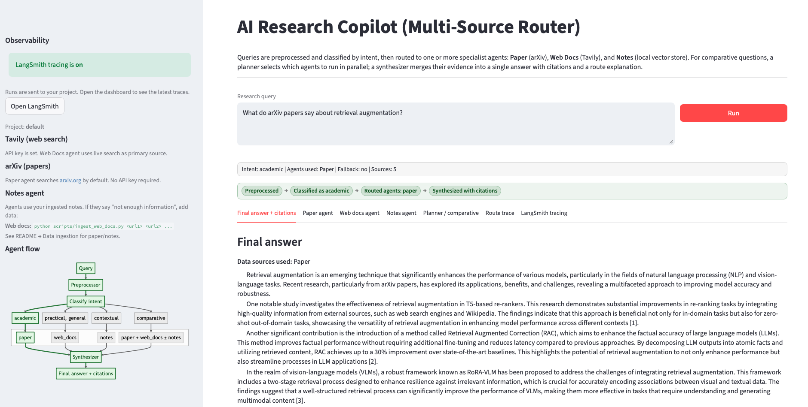
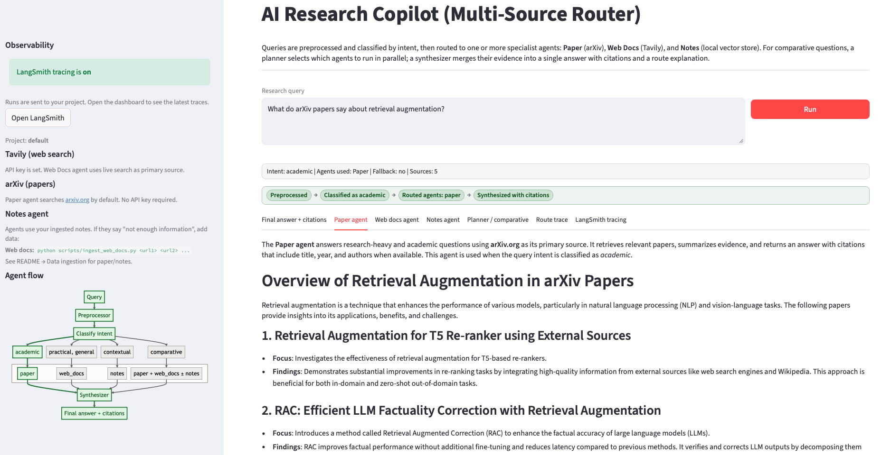
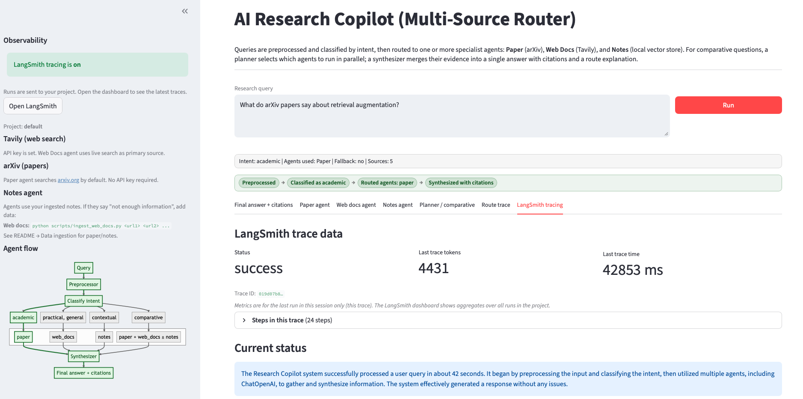

# AI Research Copilot (Multi-Source Knowledge Router)

[](https://github.com/OWNER/REPO/actions/workflows/ci.yml)

AI Research Copilot is an agentic AI system that routes user queries to specialized knowledge agents (papers, web docs, notes) based on intent and synthesizes a unified, high-quality response. The system demonstrates a production-ready router architecture using LangGraph orchestration, LangChain components, and multimodal Retrieval-Augmented Generation (RAG).

This project is a hands-on implementation of an agentic AI router architecture.

**LLM/MLOps focus:** This project demonstrates practical LLM/MLOps patterns for agentic RAG systems.

- **Reproducible routing logic:** the same query patterns follow the same routing rules (intent, planner, fallback), making behavior predictable across runs.
- **Source-grounded outputs:** final answers are tied to retrieved evidence from paper/web/notes sources, with citations instead of unsupported claims.
- **Testable orchestration:** the multi-agent workflow is covered by automated checks in CI (`ruff`, `pytest`, router smoke test), not only manual UI testing.

It also includes LangSmith observability and quality-based fallback from Paper to Web Docs when paper retrieval is weak.”.

---

## Overview

AI Research Copilot uses **source-aware intents** and a **preprocessor** before routing:

- **academic** → Paper Agent (arXiv-only)
- **practical** / **general** → Web Docs Agent (Tavily + web)
- **contextual** → Notes Agent (local vector DB)
- **comparative** → Planner decides which agents (1–3) then parallel execution

A **results-based fallback** runs the Web Docs agent when the Paper agent has no or few results. The **synthesizer** merges evidence, resolves conflict, and returns a final answer with **citations** and a **route explanation**.

---

## Agents (source specialists)

| Agent | Role | Source | Use for |
|-------|------|--------|--------|
| **Paper** | Academic retrieval specialist | **arXiv.org only** | Research-heavy questions, evidence-based explanations, comparisons backed by papers |
| **Web Docs** | Practical knowledge specialist | **Tavily web search** | Tutorials, how-to, best practice, implementation, “explain simply” |
| **Notes** | Context memory specialist | **Local vector DB** | “What do my notes say”, saved project context, continuity across sessions |
| **Synthesizer** | Evidence merger | — | Combines one or more agent outputs into one answer with source attribution |
| **Evaluator** | Quality check | — | Lightweight checks before returning (citations, question type, domains) |

---

## Architecture Overview

```mermaid
flowchart TD
    A[User Query] --> P[Preprocessor]
    P --> B[Intent Router]

    B -->|academic| C[Paper Agent]
    B -->|practical, general| D[Web Docs Agent]
    B -->|contextual| E[Notes Agent]
    B -->|comparative| PL[Planner]
    PL --> F[Planned agents (parallel)]

    %% Quality-based fallback (implemented in router_graph.py)
    C -->|if arxiv_results_count >= 1 and arxiv_quality >= 0.55| G[Response Synthesizer]
    C -->|fallback: weak paper retrieval| D

    D --> G
    E --> G
    F --> G

    G --> H[Final answer + citations + route trace]

    subgraph Data Sources
        I[arXiv.org]
        J[Tavily / Web]
        K[Local notes]
    end

    C --> I
    D --> J
    E --> K

    %% Optional observability view
    O[(LangSmith tracing)]
    P -. traces .-> O
    B -. traces .-> O
    G -. traces .-> O
```
## Key Features

- Intelligent intent-based routing (LangGraph)
- Multi-agent architecture (Paper, Web Docs, Notes)
- Multimodal RAG: Paper agent uses [arXiv](https://arxiv.org) by default; Web Docs uses Tavily + ingested URLs; Notes uses local docs
- Cross-source synthesis
- Streamlit interactive UI
- Observability and tracing (LangSmith ready)
- CI pipeline for automated linting, tests, and smoke checks
- LLM/MLOps-oriented quality, testing, and monitoring practices

## Design notes

- **Unified agent contract:** Every agent returns the same `AgentResult` shape (`answer`, `evidence`, `results_count`, `status`). The router and synthesizer never handle per-agent special cases; they always consume this contract.
- **Conservative planner:** For comparative intent, the planner is rule-based and does not over-select. Default is exactly two agents (paper + web_docs). The notes agent is added only when the query explicitly mentions the user’s notes or stored data (e.g. “my notes”, “relate to my notes”, “notes align”).

## Tech Stack
- LangGraph (routing + orchestration)
- LangChain (LLMs, tools, prompts)
- LlamaIndex (optional RAG abstraction)
- OpenAI / local LLM
- arXiv (paper search for Paper agent; no API key) and Tavily (live web search for Web Docs agent)
- Web docs loader (HTML → text for docs/blogs)
- FAISS (vector store)
- Streamlit (UI)
- GitHub Actions (CI/CD)

## Getting Started

1. **Clone the repository**
   ```bash
   git clone https://github.com/Artsplendr/ai-research-copilot.git
   cd ai-research-copilot
   ```

2. **Create and activate a virtual environment**
   ```bash
   python3 -m venv venv
   source venv/bin/activate   # On Windows: venv\Scripts\activate
   ```

3. **Create environment file**
   ```bash
   cp .env.example .env
   ```
   Edit `.env` and set your `OPENAI_API_KEY`. Optionally set `TAVILY_API_KEY` for live web search in the Web Docs agent, and `LANGCHAIN_API_KEY` for tracing.

4. **Install dependencies**
   ```bash
   pip install -r requirements.txt
   ```

5. **Run the Streamlit app** (from project root, with venv activated)
   ```bash
   streamlit run app/streamlit_app.py
   ```

## CI (GitHub Actions)

The project includes a CI workflow at `.github/workflows/ci.yml` that runs on every push and pull request:

- `ruff check . --config ruff.toml` (lint gate for syntax/runtime-risk issues)
- `pytest` (unit tests under `tests/`)
- Router boot-path smoke check:
  ```bash
  python -c "import router.router_graph as rg; assert rg.create_graph() is not None"
  ```

Run the same checks locally before opening a PR:

```bash
pip install -r requirements.txt
pip install -r requirements-dev.txt
ruff check . --config ruff.toml
pytest
OPENAI_API_KEY=test-key TAVILY_API_KEY=test-key python -c "import router.router_graph as rg; assert rg.create_graph() is not None"
```

### Data ingestion
`notes_agent` only works with your ingested notes. If `./data/faiss_index/notes` is missing or empty, the Notes agent will not return meaningful context.

Expected notes index path in this project:
- Relative: `./data/faiss_index/notes`

To ingest notes:
1. Add note files (`.md` or `.txt`) to `./data/notes/` (for example `./data/notes/rag_eval.md`).
2. Build the `notes` index:
   ```bash
   python - <<'PY'
   from pathlib import Path
   from dotenv import load_dotenv
   from langchain_core.documents import Document
   from langchain_text_splitters import RecursiveCharacterTextSplitter
   from tools.vector_store import get_or_create_vector_store, add_documents, save_vector_store

   load_dotenv(".env")
   notes_dir = Path("data/notes")
   files = list(notes_dir.glob("*.md")) + list(notes_dir.glob("*.txt"))
   if not files:
       raise SystemExit("No note files found in data/notes")

   docs = [Document(page_content=p.read_text(encoding="utf-8"), metadata={"title": p.name, "source": str(p)}) for p in files]
   chunks = RecursiveCharacterTextSplitter(chunk_size=1000, chunk_overlap=150).split_documents(docs)
   store = get_or_create_vector_store("notes")
   add_documents(store, chunks, "notes")
   save_vector_store(store, "notes")
   print(f"Saved notes index with {len(chunks)} chunks")
   PY
   ```

After this, run the app again and ask a notes-focused query (for example: "What do my notes say about chunking strategies?").

## .env.example
```
OPENAI_API_KEY=your_openai_api_key
TAVILY_API_KEY=your_tavily_api_key
VECTOR_DB_PATH=./data/faiss_index
LANGCHAIN_TRACING_V2=true
LANGCHAIN_API_KEY=your_langsmith_api_key
ENVIRONMENT=development
```
Set `LANGCHAIN_API_KEY` (and optionally `LANGCHAIN_PROJECT=research-copilot`) to send traces to LangSmith and see them in the Streamlit demo. Tavily is optional; the Web Docs agent falls back to vector store only if `TAVILY_API_KEY` is unset.

## Streamlit Demo

The UI shows a **visible route trace** for each run:

- **Query received** and **Intent classified** (e.g. `practical`, `comparative`)
- **Planner decision** (for comparative: which agents were chosen)
- **Retrieval status** (e.g. paper: 5 arXiv sources, web_docs: 8 Tavily results, notes: 2 chunks)
- **Why this route** (short explanation)
- **Final answer** and **Sources used** (citations)

Example queries that make routing obvious:

| Scenario | Query | Expected route |
|----------|--------|----------------|
| Single practical | “Explain RAG in simple terms” | `web_docs` |
| Single academic | “What do arXiv papers say about retrieval augmentation?” | `paper` |
| Single contextual | “What do my notes say about chunking strategies?” | `notes` |
| Dual compare | “Compare academic and practical perspectives on RAG evaluation” | `paper` + `web_docs` |
| Triple synthesis | “Compare what research and best practices say about reranking” | `paper` + `web_docs` + `notes` |

## Use Case

### UI Examples

Final answer with citations:



Paper agent output:



LangSmith tracing tab:


